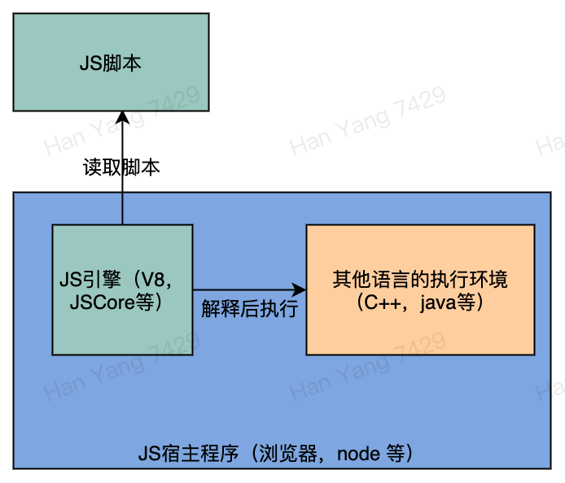

# JS基础与思想

### 内容：

* **JS概览**
* **JS基础**

> JS的标准一直在更新，且JS存在多种模块规范，这里只针对ES6标准，ESM模块规范。

\*\*\*\*

 **前提知识：**

* 对JS语言有粗略的了解
* 有其他语言一年以上的编程经验

## JS概览

**看下面一段关于JS语言定义：**

> JavaScript \(often shortened to JS\) is an easy to learn and also powerful scripting language，it is a lightweight, interpreted, object-oriented language with first-class functions, and is best known as the scripting language for Web pages, which can be used to design / program how the web pages behave on the occurrence of an event. but it's used in many non-browser environments as well. It is a prototype-based, multi-paradigm scripting language that is dynamic, and supports object-oriented, imperative, and functional programming styles.

从用途和特征角度来概括一下上面这段话：

**JS的用途：**

1. 最早用于作为浏览器上用来与Web页面交互的脚本
2. 后发展成为功能全面的编程语言，也可以用于编写非浏览器环境的程序（比如Node.js）

**JS的特征：**

1. 脚本语言
2. 函数是第一公民
3. 支持多种编程范式（支持面向对象，面向过程，命令式，函数式等）
4. 基于原型的对象系统
5. 动态的

后面会逐一介绍这每个特征，现在先来看JS的由来以及后来的ES

* > JS是1995年由网景公司开发的一款依赖宿主运行环境的脚本语言，宿主环境是自家的浏览器
* > 1996年网景将JS提交到欧洲标准组织ECMA，于是产生了ECMAScript标准，简称ES

可以看出JS是一套基于浏览器的脚本语言，ES是将JS语言提取并制订出标准，方便各家不同浏览器可以共同按照该标准解释脚本，提高JS的兼容性。随着JS使用的普及和ES这套标准的扩大和完善，越来越多的厂商开发的工具使用ES标准，于是就有了node.js和Adobe Photoshop等使用JS作为脚本语言的工具。因此现在所说的JS一般不再单纯指浏览器脚本，更多的是指遵守ES标准的脚本。ES本身就只有语法标准，基于该语法标准开发的脚本，可以在支持该语法标准的宿主环境中解释运行\(现在JS引擎也开始编译后再运行）。

这里主要介绍的就是JS中ES标准的部分，为了习惯，下面说的JS统一指ES（由于JS这个叫法更通用）

\*\*\*\*

**回头来看下JS的几个特征：**

**1、脚本语言：**虽然JS随着特性的不断完善，功能越来越强大，已经不太像我们传统认识的脚本语言（shell脚本等），不过JS本质上仍然是个脚本语言，脚本语言的特点是解释执行（无需编译、链接过程），因此需要一个解释器，且脚本语言被解释后需要执行脚本的意图，因此需要一个宿主程序负责在解释完脚本后执行实际的操作。比如前端的JS脚本宿主程序就是浏览器本身，后端的JS脚本宿主程序即node.js。而JS脚本的解释器称作JS引擎，比较知名的JS引擎有 google的V8，Mozilla的SpiderMonkey，WebKit的JSCore等。它们之间的关系如下图：

**2、函数是一等公民：**这是说JS中的函数像JS中其他对象一样，可以被当作参数传递，赋值给变量或对象的属性，相较于我们熟悉的java语言，函数是无法进行这么操作的。

**3、支持多范式编程：**JS由于其灵活的语言特征，可以由开发者的编码偏好使用不同的编程范式进行开发，也支持多种编程范式混合开发。JS的对象系统使JS很好的支持面向对象，而且JS中函数是一等公民，因此也使JS能够非常简单的支持函数式开发。

\*\*\*\*

**4、基于原型的对象系统**相对于Java或OC的对象系统是基于class的，JS的对象系统是基于原型，基于class的对象系统中类型与实例是明确的两种类型数据，基于原型的对象系统中类型与实例没有明显界限，所有对象（包括类型对象）都是从最上层的原型对象衍生而来。基于原型的与基于class的对象系统还有诸多不同之处，后面我们会详细介绍。

\*\*\*\*

**5、动态的：**JS是一门动态语言，这动态主要表现在以下方面：

1. 运行时为对象添加属性和函数
2. 运行时确定函数的参数类型和个数
3. 运行时可以改变变量的类型
4. 运行时创建新的脚本（通过eval函数）


_动态一般指运行时行为，静态指编译时行为，其实语言是动态还是静态没有绝对的分界线，只是语言在编译阶段确定下来的信息越多，则越静态，反之则越动态。现在应该对JS有了基本的了解，下面我们来看看JS的基础内容_



思考JS的动态性，在平时开发中有哪些正面作用，并会带来哪些负面作用。

参考：

JS的动态特性可以为开发带来很多灵活的功能，比如运行时修改对象属性，运行时生成JS脚本来执行等，这些可以帮助开发人员很容易实现一些复杂的特性。但是动态性也带来了很多问题，动态性有以下几个公认的问题：

1. 降低了代码的正确性
2. 降低了代码的安全性
3. 降低了代码的可预测性
4. 降低了代码的执行效率

以上这些问题在JS项目开始变的庞大后，协同开发人员变多后，将变的比较明显。特别是前三项缺点，将导致项目代码不够健壮，且在多人协同开发中导致维护人员很难理解他人代码的意图。这就是TS要解决的问题。


现在应该对JS有了基本的了解，下面来看看JS的基础内容。

