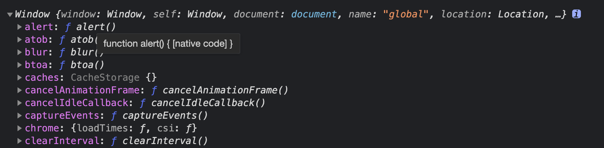

# JS基础知识-对象系统

### （三）对象系统

> js中除了基本类型，所有的都是对象类型，包括函数也是对象类型，不过由于函数的特殊性，我们把函数与普通对象分开介绍

#### 普通对象

对象类型即object类型，这里需要与Object这个包装类区分开，Object包装类本身是个函数，而函数也是对象类型，因此包装类Object是对象类型的一个实例。先看看JS操作对象的语法

```
// 简单对象
let obj = {name : 'han'};
let obj2 = new Object({name : 'han'});
// 以上两种方式效果一致，平时开发使用第一种方式。

obj.gender = 'male'; // 动态为对象增加属性

console.log(`name = ${obj.name},gender = ${obj.gender}`); // 获取对象属性


// 数组对象
let ary = [1,2,3];
let ary2 = new Array(1,2,3);
// 以上两种方式效果一致，平时开发使用第一种方式。

ary[4] = 'str'; // 动态为数组对象增加元素，元素可以是任意类型

console.log(ary[3]); // 获取数组对象未被赋值的元素，将得到 undefined


```

函数也是一种对象，但是函数比较特殊。

#### 函数对象

JS语言内置了大量的对象类型的实例，最常用的即各种构造器，比如 Object，Array，Function，String，Boolean，Number等，而这些都是函数对象。JS函数对象与普通对象有两点区别：

1. 函数对象带有一段可执行的脚本，可以被调用执行
2. 函数对象可以使用 new 操作符来创建新对象，这类函数我们叫做构造器。

**普通函数**

```
let f1 = function (name){
    console.log(name);
}

function f2(name){
    console.log(name);
}

let f3 = new Function('name','console.log(name);');
// 以上三种方式效果一致，平时开发使用1或2方式。

// 调用函数
f1('han');

```

**构造函数**

```
let User = function (name){
    this.name = name;
}

function User2(name){
    this.name = name;
}

let User3 = new Function('name','this.name = name;');
// 以上三种方式效果一致，平时开发使用1或2方式。


// 通过 new 操作符调用构造函数，会返回一个新的JS对象
let user = new User('han');
console.log(user.name);


//通过普通函数来构造对象
let createUser = function(name){
    let obj = {};
    obj.name = name;
    return obj;
}

// 从观察结果来看使用构造函数方式一致。
let user2 = createUser('han');
console.log(user2.name);


// 不过实际上两个对象是有区别的
console.log(user instanceof User);  // true
console.log(user2 instanceof User);  // false
console.log(user2 instanceof createUser); // false

```


构造函数与普通函数形式上没有任何区别，只是使用场景有区别，普通函数是用来执行一段脚本，构造函数是用来执行一段脚本后返回一个新的对象。也可以在普通函数中构造后返回对象，但是这样构造出来的对象就不是构造函数的实例，不能从构造函数中继承已有的属性，这个下面再详细说明。



明白JS是解释型的脚本语言后，就很好理解JS中的函数，函数就是JS中 带有一段可执行脚本 的对象，调用函数后就是开始解释执行函数中的脚本。



**其他形式的函数**

```
// 匿名函数
(function(){
    console.log('匿名函数调用');
})();


// 箭头函数
let arrowFn = (name) => {
    console.log(name);
}
let arrowFn2 = (name) => console.log(name);
// 箭头函数 函数题是单行的情况下，可以省略{}

arrowFn2('han');


// bind函数
let obj = {name : 'han'};
this.name = 'global han';
let printName = function(){
    console.log(this.name);
}
printName(); // 调用普通函数 , 结果 global han

// 构建bind函数
let bindPrintName = printName.bind(obj);
bindPrintName(); //  调用bind函数，结果 han

```

> 箭头函数与其他函数区别除了书写更简洁外，最大区别是this属性的不同。

> bind函数跟普通函数区别也是bind函数的this属性绑定到固定对象。


试试将箭头函数改造成bind函数，然后看看this是否变化。



#### 函数中的this

JS中每个函数都有一个this的属性，该属性的行为方式与APP开发人员熟悉的java或OC语言中的this的行为方式略有区别，java或OC方法中的this指向调用该方法的对象，但是由于java或OC中对象的方法无法被赋值给其他对象，因此方法中的this指向较为清晰。JS函数中的this一般也是指向调用该函数的对象，而上文说到JS的函数是一等公民，JS中的函数可以像普通对象那样被赋值给任何变量或赋值给其他对象，因此JS函数中的this指向是动态的，只有运行过程才能知道当前this指向哪个对象，这也是让JS入门开发人员容易迷惑的地方。

**看下代码：**

```
this.name = 'global';

let printName = function(){
    console.log(this.name);
}

let user1 = {
   name : 'user1',
   printNameFn : printName
};

let user2 = { name : 'user2' };
user2.printNameFn2 = user1.printNameFn;

user1.printNameFn();   // user1
user2.printNameFn2();  //  user2
printName();   // global
```


函数中this指向调用该函数的对象，如果是直接在全局上下文上调用的函数，则函数中this指向JS的全局this。


****

**再用上面例子看看箭头函数表现：**

```
this.name = 'global';

let printName = () => {
    console.log(this.name);
}

let user1 = {
   name : 'user1',
   printNameFn : printName
};

let user2 = { name : 'user2' };
user2.printNameFn2 = user1.printNameFn;

user1.printNameFn();   // global
user2.printNameFn2();  //  global
printName();   // global
```

**bind函数呢**

```
this.name = 'global';

let printName = function() {
    console.log(this.name);
}

let user1 = {
   name : 'user1',
   printNameFn : printName       
};

let user2 = { name : 'user2' };
user2.printNameFn2 = user1.printNameFn.bind(user1);   // 使用bind函数

user1.printNameFn();   // user1
user2.printNameFn2();  //  user1
printName();   // global
```



可以看出，箭头函数中的this永远指向箭头函数创建当时上下文中的this。bind函数被绑定到固定对象后，其this则固定指向该对象。




思考java或OC中方法的this与JS中方法的this有何异同点，造成这种不同的原因是什么？

参考：

**相同点：**

JS中函数的this与java或OC中的方法的this一般情况下都是指向调用该函数的对象。

&#x20;**不同点：**

1. JS中的函数可以绑定固定的this或手动指定this，而java或OC中一般不能这么做。
2. JS中同一函数中this可以指向任意对象，而java或OC中一般只会指向声明该函数的类或其子类的实例对象。

造成JS函数中this指向不清晰的原因是JS中函数也是一个对象，可以在运行时被赋值给任意JS对象，因此JS函数被调用时，调用该函数的对象可能是任意对象。Java或OC中方法声明后，一般不可以(不使用运行时API情况下）在运行时赋值给其他对象。


****

****

**函数的其他调用方式**

> 函数还可以通过 call 或 apply进行调用，具体这两个不同点可以自己网上查找，这里只介绍它们与this的关系。

```
this.name = 'global';

let printName = function() {
    console.log(this.name);
}

let user1 = {
   name : 'user1',
   printNameFn : printName       
};

let user2 = { name : 'user2' };
user2.printNameFn2 = user1.printNameFn;

user1.printNameFn.call(user2);   // user2
user2.printNameFn2.apply(user2);  //  user2
printName.call(user2);   // user2
```


call 与 apply 函数的第一个参数是设置被调用函数的的this值，因此上述代码中this全部指向了user2。



使用call或apply调用 bind函数或箭头函数，看看结果是什么。



#### 全局对象

上面大家看到代码里有通过全局this.name这种赋值方式，这个是什么意思呢。JS代码的执行入口也可以看作是一个函数，该函数也有this属性，该this属性就叫全局对象，在web开发中该对象也有个别名：window。

```
console.log(this);
```

打印该对象，使用浏览器运行的话会看到以下打印（使用node运行打印不一样，这是由于node的JS模块规范与web开发的JS模块规范不一样的原因，目前不用关注这个差别，大家先用浏览器来运行上述脚本）。



可以看到该全局对象上绑定了所有我们可以直接调用的函数或直接使用的对象，包括Object，Array，Number这些构造函数也是挂载在该全局对象上。


介绍完对象与函数，下面来看一个ES6中才加入的特征 class，class与APP开发人员熟悉的class行为相似，作为对象创建的模版使用。


#### class

> 对象可以通过{}方式直接创建，也可以通过构造函数创建，还有一种创建对象的方式是通过new class的方式。

```
class User {
  constructor(name){   // class 的构造函数
      this.name = name;
  }
  introduce(){      // class 中定义的对象方法
     console.log(this.name);
  }
}

let user = new User('han');   // 通过class 创建对象
user. introduce();    // 调用对象的方法
```

**class可以继承**

```
class MaleUser extends User {    // 继承User
  constructor(name){   
      super(name);    // 必须调用super
      this.gender = 'male';
  }
  introduce(){      // 重写父类方法
     console.log('name = ' + this.name + ' , gender = '+ this.gender);
  }
}

let maleUser = new MaleUser('han.yang');   // 通过子类 创建对象
maleUser. introduce();    
```


class是ES6才加入的特性，其实该特性的具体实现一般也是通过 new 函数 的方式来创建对象，可以将class理解成JS中的一个语法糖，因此通过new 函数方式创建的对象的优缺点，class也都具备。同样，既然class是通过function的方式实现的，那么function的方式肯定也是可以实现继承的。不过要理解function方式的继承，必须了解JS的原型系统。



下节我们一起了解下JS的原型系统。
