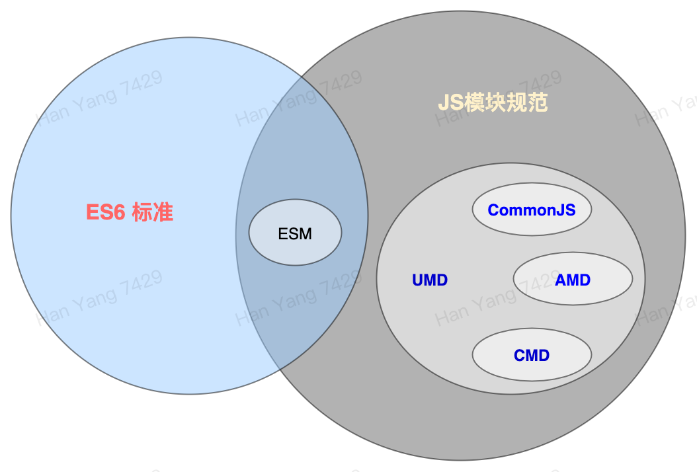

# JS基础知识-模块规范

### （五）模块规范

> JS诞生以来长期都没有标准的模块化规范，于是社区诞生的多种不同的模块规范，直到ES6(2015)发布后，才加入了基于ES标准的模块规范即ESM。


**JS的标准与模块规范**

> 模块化着眼与解决以下问题：命名冲突，数据保护，复杂依赖关系

> **JS模块化历程**

* > ES6标准之前，JS没有业界统一的 模块的概念，导致JS项目变庞大后将难以维护。为了达到模块化效果，一些JS项目通过JS语言特征自行实现一些模块化功能
* > Node.js社区为了协同开发Node.js,制定了统一的模块开发规范，命名CommonJS，这是一套JS代码开发规范和这套规范配套的几个JS文件，旨在让项目的JS代码达到模块化的效果，该规范最后成为Node.js的默认开发规范。
* > CommonJS规范只适合于后端JS开发，因为模块加载是同步的，而前端JS开发中需要加载的模块可能在远程服务器，所以并不适合使用这套规范。逐渐社区中出现了AMD，CMD，UMD等面向前端的JS模块规范。
* > JS标准组织ECMA意识到模块规范的重要性后，在ES6标准中增加了模块化规范的定义，于是有了ESM模块规范。


| **模块规范**     | **说明**                         | **实现库**                             | **使用场景**         |
| ------------ | ------------------------------ | ----------------------------------- | ---------------- |
| **CommonJS** | 适合后端开发的JS模块规范，主要特点是模块导入是同步的    | Node.js中                            | Node.js开发        |
| **AMD，CMD**  | 适合前端开发的JS模块规范，主要特点是模块导入是异步     | Require.js , Sea.js                 | Web前端开发          |
| **UMD**      | 结合了以上三个规范，做到一套规范前后端通用          | 开发人员自己实现                            | 前后端开发都可以         |
| **ESM**      | ES6标准引入的模块化规范，旨在统一JS开发中的模块化规范。 | 需要JS引擎按照标准实现，或者需要转译成其他规范运行在更早标准的引擎上 | 前后端通用，React使用此规范 |

**几种规范关系图**



****

****

> JS模块规范的发展请看：[JS模块规范发展历史](https://zhuanlan.zhihu.com/p/113009496)

****

**接下来我们主要介绍下ESM规范：**

> ESM规范中，一个包含 `import` 或 `export` 关键字的js文件，即一个js模块。

> `import` 表示为当前模块导入外部模块的内容（基础类型数据或对象数据）。

> `export` 表示当前模块为外部模块提供的内容。


**ESM模块语法**

```
/// 导出导入默认内容

// 导出默认内容
export default function (){};

// 从hello.js导入默认内容，命名为fn
import fn from './hello.js';

// 与上面方式等同
import {default as fn} from './hello.js';


/// 导出导入非默认内容

// 方式1
export function fn(){};
export function fn2(){};


import {fn,fn2} from './hello.js';


// 方式2
function fn(){};
function fn2(){};
export {fn,fn2};

import {fn,fn2} from './hello.js';

```


## 结尾

以上就是本次JS基础的所有内容，需要更加全面学习的可以从以下资料入手。


JS学习资料：

[JS资料英语](https://developer.mozilla.org/en-US/docs/Web/JavaScript)&#x20;

[JS入门学习资料中文](https://www.liaoxuefeng.com/wiki/1022910821149312)&#x20;

[JS完整学习资料中文](https://www.runoob.com/js/js-tutorial.html)


