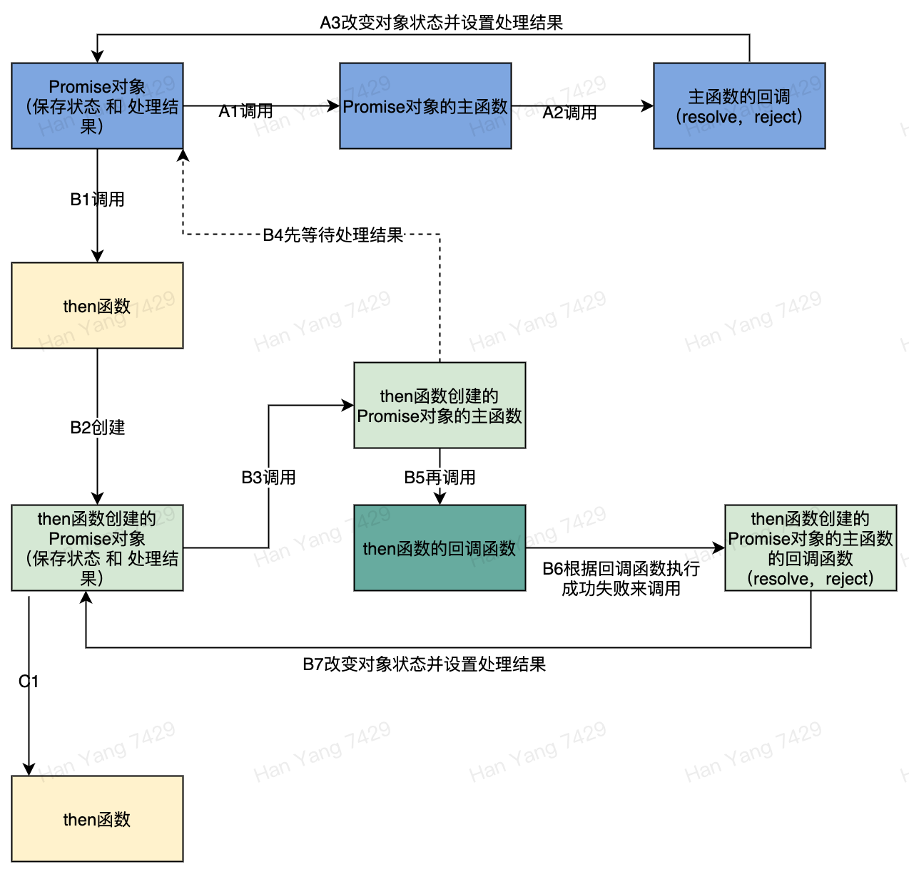

# JS基础知识-异步操作

### （五）异步操作

> 首先强调一点，JS运行时是单线程的，这是由于JS诞生之初是用来操作浏览器DOM的，因此如果JS是多线程，将会发生两个线程同时操作DOM导致状态错乱的问题，如果加锁又会导致UI显示上的性能问题，由于UI显示非常注重流畅性，因此不能对UI操作加锁，一般解决方案就是将UI的操作都放到单独线程，这跟安卓或IOS操作UI都只能在主线程道理一样。

>

> 由于JS是单线程，因此在JS中看不到任何线程相关的API（比如sleep等），因此我们无法通过开启一条新线程来执行异步任务，那JS中的异步操作是怎么回事呢？

> 答案是让宿主环境自己来完成。因此可以看到JS中的所有异步方法都是非阻塞式的且带回调函数的形式，因为那些异步API实际的执行者是宿主环境，宿主环境执行完成后需要回调函数来告诉JS端任务结果。

先看看JS中经常用到的几个异步API**定时器：**

```text
// 设置定时器，每秒执行一次回调函数（单位毫秒）
setInterval(() => {
    console.log('又过去了 1 秒');
}, 1000);                             


// 设置定时器，5秒后执行一次回调函数 （单位毫秒）
setTimeout(() => {
    console.log('过去了 5 秒');
}, 5000);
```

**网络请求：**

```text
 // 方式1
 let promise =  fetch('https://api.github.com/');
 promise.then((response)=>console.log(response));
 
 
 
 // 方式2
 async  function fetchTest(){
    let response = await fetch('https://api.github.com/');
    console.log(response)
}
fetchTest()
```

> 上述两种网络请求方式效果是一样的。

> JS中还有一种常见的异步请求方式叫AJAX，在此不做详细介绍，有兴趣可以自己了解。

上面网络请求的代码可能大家都看的一头雾水，最疑惑的应该有两点：

1. `promise.then(fn)` 是什么意思？
2. 为什么同一个函数正常调用`fetch(url)` 与加上 `await fetch(url)` 返回的结果却完全不同？

解答这两个问题，我们需要先介绍在ES6中加入的两个针对异步操作的API，它们分别是 `Promise` , `async await（一般成对出现）`。

设想在ES6没加入这几个API之前，典型的异步操作和回调如何处理？应该很容易写出下面这样的代码

```text

function asyncTest(sucCallback, failCallback) {
    // 异步操作，一般是网络请求
    setTimeout(() => {
        // 成功或者失败回调
        sucCallback('success');
        // failCallback('fail');
    }, 1000);
}


let failCallback = (err)=>console.log(`request fail:${err}`)

let sucCallback = (response)=>console.log(response)

asyncTest(sucCallback,failCallback);
```

设想倘若我们在异步请求返还成功后需要再进行另一个异步请求，另一个请求成功后又需要再进行一个异步操作，

那么代码可能会变成下面这样：

```text
function asyncTest(sucCallback, failCallback) {
    // 异步操作，一般是网络请求
    setTimeout(() => {
        // 成功或者失败回调
        sucCallback('success');
        // failCallback('fail');
    }, 1000);
}

let failCallback = (err) => console.log(`request fail:${err}`)

// 为了演示方便，这三次网络请求都使用同一个函数
let sucCallback = (response) => {
    asyncTest((response) => {
        asyncTest((response) => {
            console.log(response);
        }, failCallback)
    }, failCallback)
}

asyncTest(sucCallback, failCallback);
```

上面的代码是不是看的很抓狂，多重嵌套在任何代码中都是不受欢迎的，而且实际情况可能比这还要复杂的多，那样就很容易写出难以维护的代码。

为了应对这类场景，ES6中引入了`Promise`，我们来看看`Promise`如何应对这种嵌套的异步操作。

将上述代码用`Promise`改造后

```text


// 创建一个函数执行异步操作，该函数有resolve与reject两个参数，resolve表示该异步操作成功后的回调，reject则是失败的回调（这是promise方式的回调命名风格）
function asyncTest(resolve, reject) {
    console.log('asyncTest');

    setTimeout(() => {
        // 成功或者失败回调
        resolve('success');
        // reject('fail');
    }, 1000);
}


// 创建一个Promise，参数是一个函数，Promise一经创建，则立即执行该函数
const apiCall = new Promise(asyncTest);

const failCallback = (err) => console.log(`request fail:${err}`)


apiCall.then(     // 调用promise的then方法将 成功的回调函数 设置给Promise
    () => new Promise(asyncTest)   
    // 成功的回调函数中，返回另一个Promise
).then(     // 为上一个 成功回调函数 中返回的Promise设置 成功回调函数。
    () => new Promise(asyncTest) 
    // 成功的回调函数中，返回另一个Promise
).then(
    (response) => console.log(response)    
    
).catch(failCallback); // 设置失败回调，上面任意一个Promise执行的函数中调用了reject函数，都将停止整个调用链，直接调用该失败回调。

```

> 可以看出，Promise显著改善了嵌套场景，我们来看一下Promise能做什么。

1. 首先Promise构造器接收一个函数，并立即执行该函数，我们称这个函数为`promise主函数`。
2. 然后promise对象的`then`方法接收一个回调函数，该回调函数将在`promise主函数`中resolve被调用后执行。
3. `then`方法会返回另一个promise对象。
4. promise对象的`catch`方法接收一个回调函数，该回调函数将在`promise主函数`中reject被调用后执行。
5. `catch`方法会返回另一个promise对象。
6. promise对象还有`finally`方法接收一个回调函数，该回调函数将在promise所有任务都结束后被调用，上面代码为了清晰没有展示，大家可以自己尝试。
7. `then`方法第二个参数接受reject回调，与使用promise.catch方式处理reject方式执行顺序上有区别，`then`方法中的reject将优先执行，详细的可以自己了解，平时开发更多使用catch方式。


这种promise嵌套promise的调用方式，我们称作`Promise chain`


看完可能会觉得有点绕，我们用一个图来展示下Promise的执行过程：


这张图展示的是`Promise chain` 的执行过程，Promise存在三种不同状态，分别是：

* pending: 初始状态
* fulfilled: 表示任务成功完成（resolve被调用）
* rejected: 表示任务失败（reject被调用）

结合这些知识我们再更加详细的看一下Promise的执行步骤（为了不会太混乱，reject步骤就不阐述）：

1. Promise会执行主函数，并根据主函数的不同回调（resolve 与 reject）被执行后相应改变自身状态
2. 多个Promise可以通过`then`方式串起来形成`Promise chain`，`Promise chain` 中下一个Promise会等待上一个Promise执行完成后（即resolve或reject被调用），调用`then`方法中对应的成功或失败回调函数，并将上一个Promise执行结果作为回调函数的参数传递，并等待返回值。
3. 如果`then`方法中的回调函数执行后返回的还是一个Promise，则继续等待该新的Promise执行结果。
4. `then`方法中的回调函数执行完成后，根据成功或失败，调用Promise自身主函数的resolve或reject回调来改变自身状态。
5. 然后链条中下一个Promise的执行函数仍然按照上述步骤执行。

画出这几个元素互相之间调用关系图：




可以看出整个Promise链中，最主要的就是`then`方法的实现，那我们来尝试用伪代码实现一下`then`方法，加深对Promise流程的理解

```text
Promise.prototype.then = function (onFullfillment , onRejection){
   function mainFn(resolve,reject){
   
       // 这里this就是链条中的上一个promise，await指等待它的执行结果
       let result = await this;   
       
       // 如果执行结果返回的是一个Promise，
       // 则继续等待这个Promise执行结果，直到返回非Promise
       while（result instanceof Promise){
           const retPromise = result;
           result = await retPromise;
       }
       
       // 用执行结果作为参数调用 then的回调函数
       let fullFillResult = onFullfillment(result);
       
       // 如果返回的是一个Promise，
       // 则继续等待这个Promise执行结果，直到返回非Promise
       while（fullFillResult instanceof Promise){
           const retPromise = fullFillResult;
           fullFillResult = await retPromise;
       }
       
       
       // 将执行结果作为该函数所属的Promise的执行结果
       resolve(fullFillResult);
   }
    
    // 使用mainFn作为主函数创建一个Promise
    const promise = new Promise(mainFn);
    
    return promise;
}
```

> 这里没有加入reject流程的处理（还有finally流程也没处理），Promise实际处理流程要复杂的多，这里为了方便理解，仅尝试实现Promise成功流程的伪代码。

> 有兴趣的同学可以尝试理解上述伪代码，相信可以加深你对Promise的理解。

> 也可以尝试在上述代码中增加reject流程的处理。

现在用一句话总结下Promise的作用：


Promise使用链式调用的方式替代嵌套的方式来完成异步操作。



没有JS经验的同学可能看完这么多Promise内容反而感觉更懵了，没有关系，在JS中Promise对初学者来说确实是比较难理解的一个概念，刚开始大家只要知道Promise的简单使用即可，后面开发涉及到复杂的异步操作后再来深入了解也不迟。

可能ES也觉得Promise用起来比较麻烦，就又加入了 `async await` 方式的异步操作来简化Promise。下面我们就一起来学习 `async await` 是怎么帮JS程序员从异步代码的深渊中解脱出来。

**async await：**

简单介绍下这两个的作用：

* `async` ：用来定义一个异步函数（执行后返回一个Promise对象），该函数中可以使用 `await`关键字来等待某个Promise执行完毕
* `await` : 等待一个Promise执行完毕并返回它的执行结果，只能在 async函数中使用

我们把上面使用Promise异步操作的代码用 `async await`来实现，大家做个比较

```text


function asyncTest(resolve, reject) {
    console.log('asyncTest');

    setTimeout(() => {
        // 成功或者失败回调
        resolve('success');
        // reject('fail');
    }, 1000);
}

const failCallback = (err) => console.log(`request fail:${err}`)


// 定义一个async function
async function asynFn(){

    // asycn function中可以使用 await来等待一个Promise执行完成，并得到Promise的执行结果
    let result = await new Promise(asyncTest);

    // 等待下一个一步任务的完成
    result = await new Promise(asyncTest);

    result = await new Promise(asyncTest);

    // 所有任务完成后打印最终结果
    console.log(result);

}

// async function调用后返回的是一个Promise，该promise可以添加失败拦截
asynFn().catch(failCallback);
```

怎么样，是不是比上面使用Promise链的方式简洁很多。

一句话总结下`async await`的作用：


`async await`使用异步函数来等待获取Promise的执行结果，使Promise chain的调用更加简洁。



关于JS中的异步操作就介绍到这里，学完这些相信已经可以应付JS中常见的异步场景，关于更加复杂的异步场景，大家可以等到开发中遇到了再去进一步详细学习。 下面我们介绍下JS中的模块规范。

