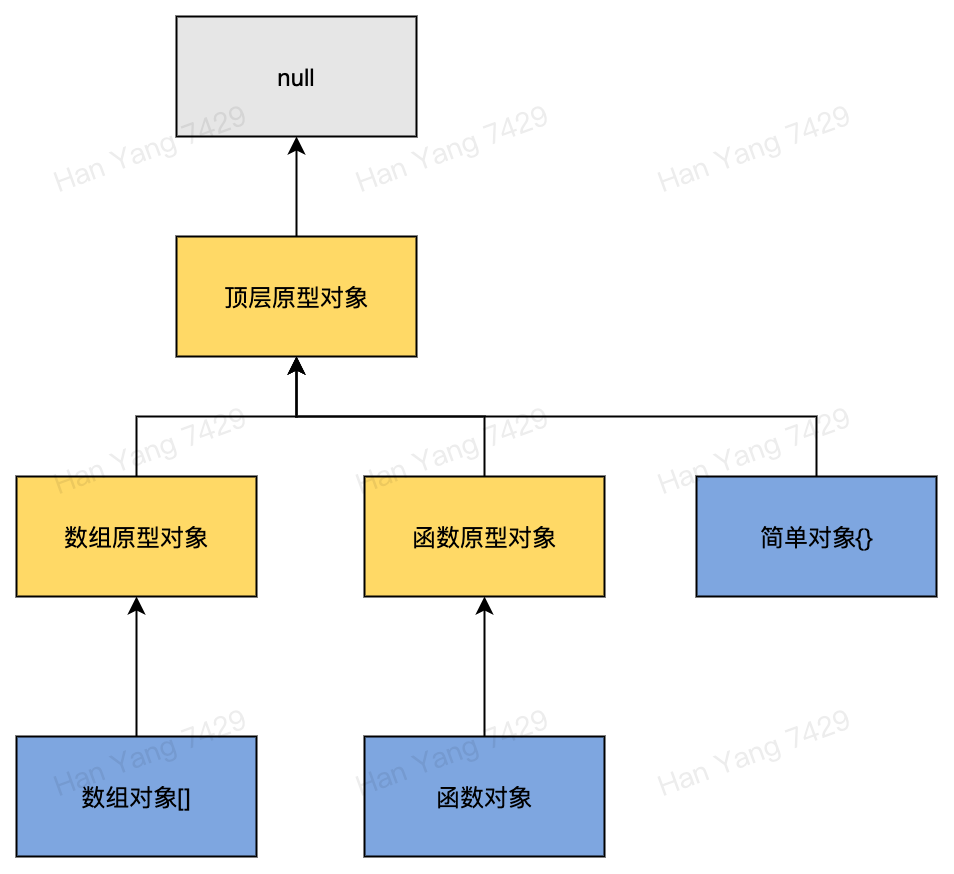
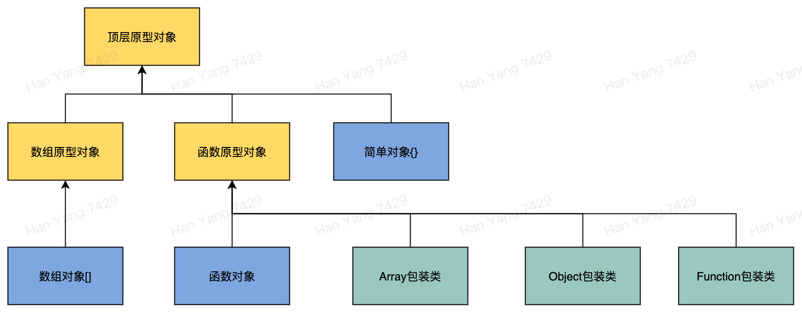

# JS基础知识-原型系统

### （四）原型系统

> 上面例子提到使用 new Fn\(\)得到的对象与使用 fn\(\) 返回同样数据的对象，他们在实际构造是有存在区别的。这就涉及到JS的原型系统。

> 课程开头讲到，JS是基于原型的对象系统，下面一起来看看这个原型系统的全貌。


一句话解释什么是基于原型的对象系统：

> 所有的对象都是直接或间接基于最顶层的一个对象为原型创建出来的。

具体实现上，JS对象的创建，都是基于另一个对象为原型来创建的，看下代码

```text
let user = {
    name : 'han',
    introduce : function(){ console.log(this.name); }
};

user.introduce();


let maleUser = Object.create(user);  // 使用user作为原型创建新的对象
maleUser.name = 'man';
maleUser.introduce();  // 输出 man

console.log(maleUser); // 打印下maleUser对象
```

> 打印maleUser，会发现maleUser对象并没有introduce方法，但为什么它可以调用到该方法？

> 仔细看打印的输出，会看到到maleUser对象有一个属性叫\_\_proto\_\_ , 而该属性值就是user。

这里引入两个概念：

1. **\_\_proto\_\_属性**：使用`Object.create(user)`的时候，会将user对象作为新创建对象的原型属性`__proto__`
2. **Prototype chain** ：JS中查找对象属性的时候，会先从对象本身的属性查找，没找到则从对象的`__proto__`属性上找，再没找到则从 `__proto__.__proto__`上找，直到最后找到或最后的`__proto__`为空则结束，这链条叫 `prototype chain`。

上面说到原型系统有个最顶层的对象作为所有对象的顶层原型，那这个对象是哪个？

```text
console.log({}.__proto__);   
console.log({}.__proto__.__proto__); // null
```

> 从上述打印看出，最基础的对象也是基于某个`__proto__`创建的，而该`__proto__`对象的原型属性为空，因此可能该原型就是顶层原型。实际也确实如此。

再来看看上面提到的包装类Object和Function，我们知道Object也是一个函数，函数是一个对象，那Object的原型是顶层原型吗？

```text
console.log(Object.__proto__ === {}.__proto__);   // false
console.log(Object.__proto__.__proto__ === {}.__proto__);   // true
console.log(Function.__proto__ === {}.__proto__); // false
console.log(Function.__proto__.__proto__ === {}.__proto__); // true
console.log(Function.__proto__ === Object.__proto__); // true
```

> 发现Object与Function的原型都不是顶层原型，但是他们各自的原型是同一个原型。

这时大家可以已经开始有点混乱，我们用一张图来理清一下这个`prototype chain`



这张图比较清晰，即所有函数对象都是基于函数原型对象，而简单对象是直接基于顶层原型对象，当然函数原型对象与数组原型对象都算是简单对象，在JS中除了基础类型其余都是对象。

下面我们往图中加入包装类



> 可能看起来比人容易让人迷惑，但是要谨记所有包装类都是函数对象，因此他们在原型链中的位置与函数对象一致。


那肯定大家又会疑惑，包装类比如Object与简单对象object直接的关联是什么样的。

这里我们需要引入另一个概念 **prototype，prototype** 跟上面所说的对象原型`__proto__`不是一个东西，它是函数对象特有的一个属性，由于该属性名称叫`prototype`也导致JS的原型系统更容易让人迷惑，大家不要把这个 **函数对象的原型属性\(prototype\)**与**对象的原型** 两个概念搞混，**函数对象的原型属性\(prototype\)**本身与原型链无直接关系。

那这个**prototype**用来做什么呢？

我们先来看下如下打印

```text
let User = function(){}
console.log(Function.prototype === User.__proto__ ); // true

let user = new User();
console.log(User.prototype === user.__proto__);  // true


```

这样可能还不容易看出规律，我们换个方式创建函数

```text
let User = new Function();
console.log(Function.prototype === User.__proto__ ); // true

let user = new User();
console.log(User.prototype === user.__proto__);  // true


```

> 可以看出，函数对象中的**prototype**属性与使用 `new` 该函数创建的对象的`__proto__`属性一致，

> 说明当我们通过 `new`的方式创建对象的时候，该对象的`__proto__`属性被默认赋值为构造函数的**prototype**。


那这个有什么用？

上面介绍class的时候介绍了class的继承，我们说过class的功能也可以通过函数方式来实现，那函数方式创建对象是怎么实现的继承？

答案就是通过函数的**prototype** 与对象的`__proto__`属性。

我们代码上用不同的方式实现一下之前用class实现的继承关系，然后比较优缺点：

**第一种：**

```text
function User(name){
  this.name = name;
  this.introduce = function(){
    console.log(this.name);
  }
}


let user = new User('han');   
user.introduce();    


function MaleUser(name){
  User.call(this,name);    // 通过调用User构造方法，传入当前构造函数的this，实现利用其他函数为自己构造对象的效果。
  this.gender = 'male';
}


let maleUser = new MaleUser('han.yang');  
maleUser. introduce();   

console.log(maleUser);
```

> 打印`maleUser` 会看到`maleUser.__proto__`对象指向的是`MaleUser.prototype`,而`MaleUser.prototype.__proto__`则指向了顶层原型对象，因此看似并没有通过`prototype chain`机制实现继承，这种方式的缺点是导致创建的太多冗余的函数，比如每次创建MaleUser的实例对象，都要重新创建`introduce`函数。

**第二种方式：**

```text
function User(name){
  this.name = name;
}
User.prototype.introduce = function(){
    console.log(this.name);
}


let user = new User('han');   
user. introduce();    


function MaleUser(name){
  User.call(this,name);   //  类似super的作用
  this.gender = 'male';
}
MaleUser.prototype.__proto__ = User.prototype;

let maleUser = new MaleUser('han.yang');  
maleUser. introduce();   

console.log(maleUser);
```

> 打印上可以看到，利用函数的**prototype**属性，在对象的原型链上实现了一种继承关系，通过这种方式实现的继承，函数仅创建一次即可。（JS中的继承概念对应在代码上就是 B.\_\_proto\_\_ == A,我们则说B继承A）。


思考下JS中的继承与java或OC中的继承实现的效果上有何不同的地方。（从JS是基于原型对象的继承链角度思考）

`参考：`

Java或OC中的类型和实例是两套系统，类型定义了实例的模版和方法，继承是类型系统上的继承，实例是按照类型的模版构建，先按照父类模版构建，再按照子类模版构建，这里涉及到父类，子类，子类实例三个对象。

 JS的继承是通过原型链的方式实现的，类型与实例没有显著界限，只是在使用场景上做区分。JS的对象构建是初始化一个对象A，并将对象的\_\_proto\_\_属性设置为另一个对象B，则可以理解为A继承自B，而A本身也可以作为其他对象的原型，因此JS的继承可以理解为是实例对实例的继承。可以说Java或OC的继承只是子类型继承了父类型的模版和方法，而JS中的继承是子对象继承了父对象本身，拥有父对象所有的属性、方法、和值,且JS对象的原型可以随时被修改，从语意上就是JS中的继承关系在运行时可以被改变。



上面我们对JS的对象系统做了一个概览，刚接触JS的同学看完肯定会一头雾水，JS的对象系统与APP开发人员熟悉的 class-对象 系统存在许多差异点，大家也不需要急着一次性吸收，只要对这个对象系统有一个基本印象即可，后面实际开发中再逐步加深理解即可。

 不过有一个概念一定 要时刻牢记 ：


JS中除了基础类型数据，其余的都是对象。


介绍完JS对象系统后，下面看一下JS中的异步操作。 

开发中时常都会遇到异步操作，比如文件读写，网络请求等，那么在JS中我怎么处理这些异步操作呢。

