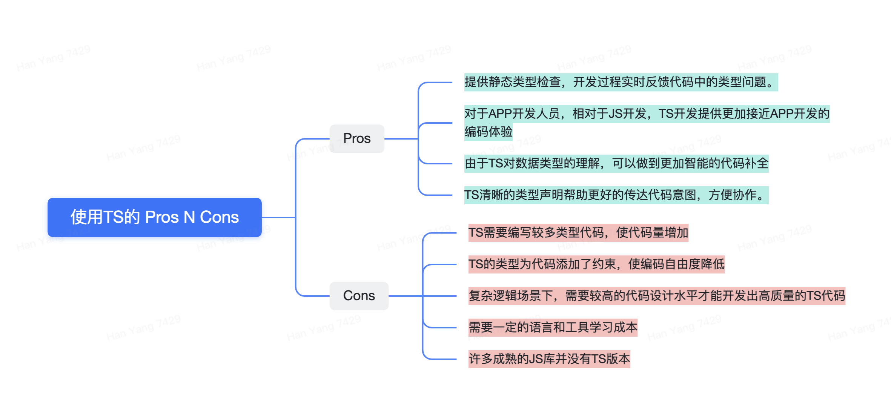

# TS基础与思想

### 内容：

* **为什么要使用TS**
* **TS基础**

****

> **学习本系列要求具备以下经验：**

* > 熟悉JS语言特征与语法

> **本系列关注点：**

> 主要是介绍TS语言特性和TS语言背后的设计思想。

## 为什么要使用TS

### TS是什么

> TS是一个由微软公司于2012年开发并维护的编程语言（2020年08月发布了4.0版本）。

> 它是JS语言的语法扩展，在JS语言上扩展了类型描述语法，并提供根据类型描述进行静态类型检查的工具。

#### TS能做什么

* > 由于JS是动态类型语言，TS在JS语法基础上扩展了类型语法，让开发者在代码中可以添加类型相关的信息，并提供TS编译工具(TSC)帮助在开发阶段发现代码中的类型问题（a.k.a 静态类型检查）。
* > TSC 还会检查JS代码的逻辑，帮忙发现代码中明显的逻辑错误。（比如发现某个永远不可能被执行到的条件分支）
* > 借助TS编译器对代码中类型信息的掌握，还可以衍生出其他开发辅助工具，比如利用了TS该特性工具有 JS代码编辑器的代码智能提示，代码自动补全，代码智能纠错，代码智能重构，点击变量跳转到变量类型声明处，查找所有引用了某变量的代码位置 等功能。
* > TSC还能对JS语法进行降级处理（比如 ES6降级到ES5）。
* > TSC还支持对检查的严苛等级进行设置，支持对空值的检查和提示。

#### TS诞生背景

> 早期JS只是用来处理网页表单验证和提交的，一般代码量很少，因此JS语言最早诞生的时候并没有考虑在大型项目中的应用场景，导致JS语言本身设计不够严谨，没有加入静态类型检查机制，所有数据类型都是到运行时才确定，开发人员开发过程中只能根据自己的经验进行判断。

> 小型项目中，由于开发人员可以很容易了解到项目全貌，且整个项目可以以较小的代价进行全方位测试，JS的这个缺陷产生的影响还是可控的。

> 随着JS越来越流行，使用JS开发大型项目越来越多，JS这些缺陷的影响开始变得严重，类型错误成为大型JS项目运行出错的最大问题。

> 多人协作的大型项目不可能每个开发人员对整个项目的所有细节和约定都了解，更不可能测试代码可能运行的所有场景。

> 像Java这种面向大型项目的语言，一般都自带静态类型检查的功能，帮助开发者从开发阶段就避免了大量类型不匹配产生的问题。

> TS正是出于这个诉求而诞生，它通过扩展JS语法，增加了一套类型定义语法，并提供根据这些语法进行静态类型检查的工具，帮助开发者在开发阶段就避免类型错误问题，提高大型JS项目协作开发效率，和项目运行的安全性和稳定性。


**思考题：**

1**、**能否直接通过不停运行JS进行类型错误检查？

2**、**能否不增加类型定义语法，仅仅是通过TS代码检查就找出JS代码中的类型问题？

**参考：**

1**、**非常简单的JS项目确实可以通过该方式进行检查，无需用到TS。但是实际项目都比较复杂，有大量的场景和逻辑分支，运行JS代码不可能覆盖到所有这些场景和逻辑分支，即使仅大部分覆盖，也将耗费大量的测试精力。因此不可行。

2、不行，编译器对类型的推断肯定是不明确的，因为编译器只有代码的实现逻辑，而缺少代码的需求信息，这块信息只有开发人员清楚，因此必须由开发人员显示指定类型来告诉编译器这块信息。


****

#### TS使用特点

* > 语法上完全兼容JS。（即所有JS代码也是TS代码）
* > 无运行时。（仅在编译阶段做代码检查，运行阶段所有TS特性都被擦除。Enum除外，这里不讨论TS的Enum类型）
* > 可被JS项目逐步采纳。（因此采用TS无需对整个项目做改造）
* > 支持非侵入性类型定义（由于存在众多被大量使用的JS库，将所有JS库改造成TS显然不实际，因此TS设计成可以在不修改JS库的情况下，为JS库中的文件编写对应的类型定义。）

### 使用TS的 Pros and Cons

### JS项目使用TS开发的理由

> **TS开发带来的好处很多，但是也引入了更多的约束和复杂度，增加代码量和学习成本等问题。**

> **分别来看看TS引入的几个“负面影响”：**

1. 代码量增加问题：
   1. 如果不引入TS，正规的JS代码便将需要写更多的注释，因此代码量增加并不显著。
   2. 且TS即使运用在原封不动的JS代码上，也提供了类型推断功能帮忙发现一些明显的类型问题和简单的代码逻辑问题，因此代码量增加的问题可以考虑。
2. 代码自由度降低，复杂场景需要更高代码设计水平问题：：
   1. 自由度高低有两面性，代码自由度高低于代码问题隐患高低往往成正比，在大型项目中，代码稳定性比自由度要重要
3. 学习成本问题：
   1. TS官方文档非常完善，且社区活跃度高，学习过程的问题将很容易得到解答。
   2. 对于习惯使用具有静态类型检查功能的语言（如java，OC）的开发者来说，将很容易习惯TS开发。
4. 许多JS成熟的第三方库支持问题：
   1. 很大一部分JS库的新版本都已经支持TS
   2. 有专门TS社区`(@types organization)`负责为已经存在的但还没支持TS的JS公共库编写TS类型支持，目前绝大部分常用的的JS库已经都有了@types 支持，完全满足开发需求。
   3. 如果用到不支持TS的库且@types上也无法找到对应的TS支持，则可以选择自己为该库编写TS声明文件，或者不做额外修改直接使用，使用该库的那部分代码也能享受到部分TS的代码检查功能。

> 从上可以看出，大部分负面影响很有限，

> 加上TS经过8年发展，当前已经比较完善，且具有完备的工具支持，非常全面的第三方库支持，已经为我们扫清了使用它的障碍，因此我们RN项目中将引入TS进行开发。

下面将介绍TS开发的基础知识。

## 参考资料：

> 大部分资料都来自官网，官网资料非常全面且清晰，但是同时内容也比较多，可以只检索自己想了解的内容进行阅读。


[TS官方文档](https://www.typescriptlang.org/docs/)

[TypeScript 中文手册](https://typescript.bootcss.com)


